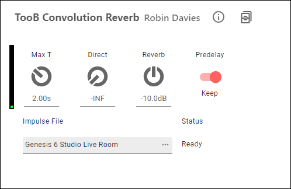
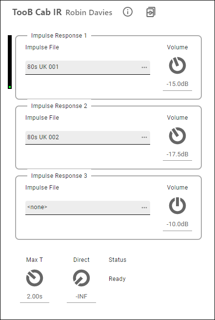

# ToobAmp LV2 Guitar Amp Plugins

v1.0.12

ToobAmp LV2 plugins are a set of high-quality guitar effect plugins for Raspberry Pi. They are specifically designed for use with the [PiPedal](https://github.com/rerdavies/pipedal) project, but work perfectly well with any LV2 Plugin host.

Currently supported platforms:

- Raspberry Pi 4 or 400, at least 2GB RAM
- Raspberry Pi OS (64-bit), latest version.
- Ubuntu 21.04 or later (arm64 or amd64), at least 2GB RAM

## Install ToobAmp

Download the current install package for your platform:

* [Ubuntu 21.04 or later; Raspberry Pi OS 64-bit (bullseye) or later](https://github.com/rerdavies/ToobAmp/releases/download/v1.0.12/toobamp_1.0.12_arm64.deb)

* [Ubuntu 21.04 or later; amd64/x64](https://github.com/rerdavies/ToobAmp/releases/download/v1.0.12/toobamp_1.0.11_arm64.deb)

Run the following shell commands:

    sudo apt update
    cd ~/Downloads
    sudo apt-get install ./toobamp_1.0.12_arm64.deb
    
--------------------

&nbsp;

*   **TooB Convolution Reverb (NEW!)**

    Simulates reverb from pre-recorded impulse response files.

    &nbsp;

    &nbsp;&nbsp;&nbsp;&nbsp;&nbsp;&nbsp;

    &nbsp;

*   **TooB Cab IR (NEW!)**

    Simulates guitar cabinet frequency responses from pre-recorded impulse files.

    &nbsp;

    &nbsp;&nbsp;&nbsp;&nbsp;&nbsp;&nbsp;

    &nbsp;

*   **Toob ML Amplifier**

    Artificial-Intelligence/Machine-Learning-based emulation of a number of different guitar amps and overdrive/distortion
    pedals. 

    &nbsp;

    &nbsp;&nbsp;&nbsp;&nbsp;&nbsp;&nbsp;

    &nbsp;

*   **TooB CE Chorus**

    A faithful digital replica of the Boss CE II Chorus.

    &nbsp;

*   **TooB Freeverb**

    A particularly well-balanced reverb, based on the famous Freeverb algorithm.

    &nbsp;

    &nbsp;&nbsp;&nbsp;&nbsp;&nbsp;&nbsp;

    &nbsp;

*   **TooB Input Stage**

    For initial conditioning of guitar input signals. Trim level, noise-gating, and an EQ section that 
    provides low-pass, hi-pass and bright-boost filtering.

    &nbsp;

    &nbsp;&nbsp;&nbsp;&nbsp;&nbsp;&nbsp;

    &nbsp;

*   **TooB Tone Stack**

    Guitar amplifier tone stack. Select a Fender Bassman, Marshal JCM800, or Baxandall tone stack.

    &nbsp;

    &nbsp;&nbsp;&nbsp;&nbsp;&nbsp;&nbsp;

    &nbsp;    

*   **TooB Power Stage**

    Guitar amplifier power stage emulation. Three super-sampled gain stages with flexible control over
    distortion/overdrive characteristics allow you to generate anything from warm sparkling clean tones
    to blistering full-on overdrive. Generally used in conjunction with the TooB Tone Stack and Toob CamSim 
    plugins.

    &nbsp;

    &nbsp;&nbsp;&nbsp;&nbsp;&nbsp;&nbsp;

    &nbsp;

*   **TooB Cab Simulator**

    Rather than relying on expensive convolution effects, Toob CabSim provides an EQ section designed to 
    allow easy emulation of guitar cabinet/microphone combinations. 

    &nbsp;

    &nbsp;&nbsp;&nbsp;&nbsp;&nbsp;&nbsp;

    &nbsp;

*   **TooB Tuner**

    An stable, accurate guitar tuner. (Currently only useful with PiPedal).

    &nbsp;

    &nbsp;&nbsp;&nbsp;&nbsp;&nbsp;&nbsp;

    &nbsp;

*   **TooB Spectrum Analyzer**

    Live-signal spectrum analyzer. (Currently only useful with PiPedal).

    &nbsp;

    &nbsp;&nbsp;&nbsp;&nbsp;&nbsp;&nbsp;

    &nbsp;

## Building ToobAmp

##### Prerequisites

Run the following commands to install prerequisites:

     sudo apt update
     sudo apt install build-essential
     sudo apt install cmake
     sudo apt install lv2-dev libboost-iostreams-dev libflac++-dev zlib1g-dev libdbus-1-dev

Clone the repository to your local machine.

In the project directory, run:

     git submodule update --init --recursive

If you are using Visual Studio Code, you will still need to perform the previous command after 
cloning the project, since Visual Studio Code does not yet understand submodules.

##### Building 

ToobAmp was built using Visual Studio Code, with CMake build files, so it's easier to configure and build 
TooBAmp if you are using Visual Studio Code.

If you are using Visual Studio code, install the Microsoft CMake extension, and load the project directory. Visual Studio Code
will automatically detect and configure the project. Build and configuration tools for the CMake project can be accessed on the Visual Studio Code status bar.

If you are not usings Visual Studio Code, the following shell scripts, found in the root of the project, can be used to configure, build and install the project:

    ./config.sh     #configure the CMake project
   
    ./build.sh   # build the project.
    
After a full build, run the following command to install ToobAmp:

    ./install.sh
	
To build the debian package, run

    ./makePackage

Please relocate components, and package information if you're going to permanently fork ToobAmp to ensure that 
Debian packages don't conflict with each other.

If you are building the plugins for use with a host other than PiPedal, you should read this:

    https://rerdavies.github.io/pipedal/RTThreadPriority.htm

